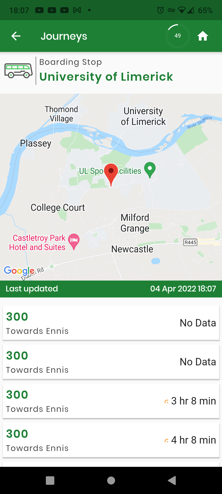
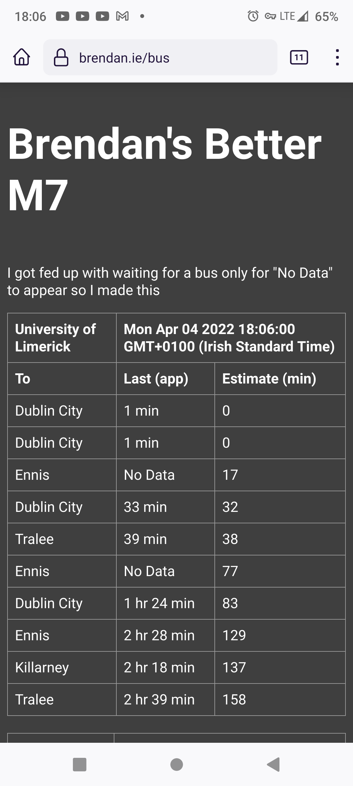

# Better 300

I am sick and tired of missing busses home as well as busses magically becoming "No Data".
See below for examples.

This project is to provide better tracking info based on the exact same data the app uses.

## Frontend

* [Link]
* [Source Code]

[Link]: https://brendan.ie/bus
[Source Code]: https://gitlab.com/brendan.ie/v1/-/blob/main/src/bus.html

## Reasons

The bus to Ennis is supposed to go every hour, yet we see two ``No Data``'s and a two hour gap, this often persists until it reaches Ennis.  
Here is a screengrab of the app yeaterday (April 4th)

Thankfully my tool captured the last estimate times

